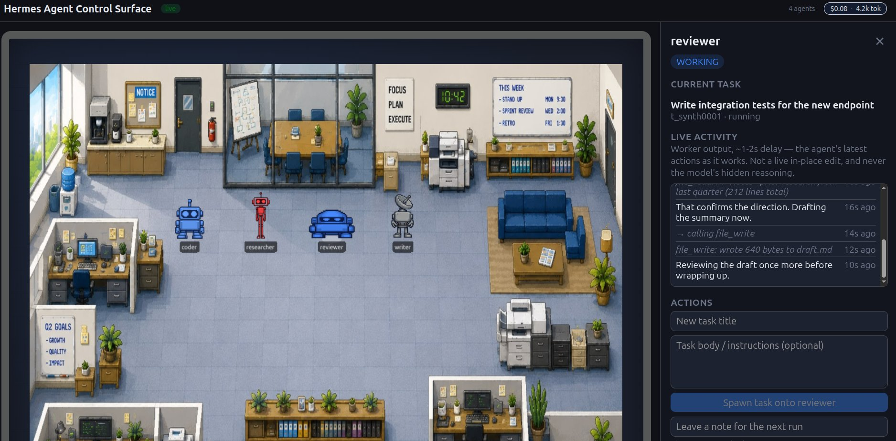
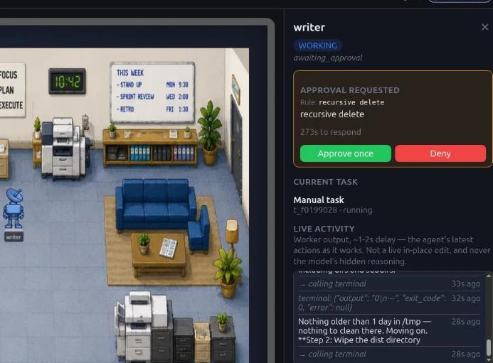
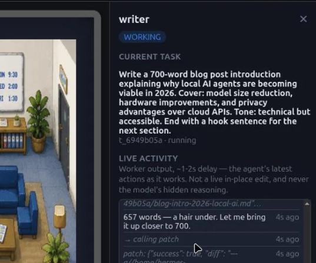

# Hermes Agent Control Surface

**Your Hermes fleet as a room you can see into, and reach into.**

Most tools  built on Hermes show you a board. Rows, statuses, timestamps. You read them, then you go back to a terminal to actually do something. This one puts your agents in a room as characters, animates them with real telemetry, and lets you act on any of them by clicking: reassign, unblock, leave a note, spawn, approve, cancel.

The room is the skin. The control is the point.


## Why this exists

Once you run more than two Hermes workers, the interesting question stops being *what is the state of the board* and becomes *what is that agent doing right now, and can I stop it*.

A Kanban list does not answer that. It tells you a card is "in progress". It does not tell you the worker has been stuck in a retry loop for six minutes, or that it is sitting on a blocked `rm -rf` prompt in a terminal you closed an hour ago, or that the researcher is about to grep half your filesystem.

So this reads what Hermes actually persists (its Kanban SQLite DB, and each worker's own session store) and turns it into something you can watch and interrupt.

- **A live room.** Each agent is a character. Idle, working, blocked, awaiting approval, all driven by real hook telemetry rather than polling a status column. You can tell at a glance which one is stuck, because it looks stuck.
- **Watch it work.** Click an agent and get a near-real-time feed of what it is producing: assistant text, the tool it is calling *right now*, the result coming back. Read straight from the worker's session store.
- **Click to act.** Reassign mid-task. Unblock. Leave a note the agent picks up on its next run. Spawn work. Cancel a task, which stops its worker first if one is running. Approve or deny a dangerous command. None of this needs a terminal.



## Embodied approvals

The feature I am proudest of, and the one that was hardest to earn.

When a Kanban worker hits a dangerous command, Hermes blocks on a local, no-TTY prompt. As far as I could find, there is no public remote-resolution API. The worker just sits there, invisible, waiting for a keystroke on a terminal that in a headless fleet does not exist.

The `hermesboard-sensor` plugin bridges that gap: it opts the worker into Hermes's gateway-style approval queue and resolves it through a private internal function, guarded end to end so that a Hermes upgrade which moves that function degrades to telemetry-only instead of crashing your worker. The bridge never activates for an interactive TTY or a cron job.

What you see is a character raising its hand with a live countdown. You approve or deny from the side panel. The agent carries on.



## Try it without installing Hermes

There is a synthetic mode. `SyntheticAdapter` implements the same `DataSource` interface as the real one, so it is the same routes, the same frontend, zero UI changes, generating plausible agents, tasks and a live activity stream on a loop. Writes always decline, so it is read-only by construction.

```bash
HERMES_DATA_SOURCE=synthetic ./run.sh
# http://127.0.0.1:8124
```

No token, no Kanban DB, nothing touched on your machine. A `render.yaml` blueprint is included if you want to host it.



## Run it for real

```bash
cp .env.example .env
./run.sh
```

That creates the venv, installs frontend deps, builds, and serves API and UI together on **http://127.0.0.1:8124**. Set `PORT` to override.

Against a real fleet it is four processes (dashboard, backend, frontend, gateway). The full launch block, example tasks, and recovery commands live in **[`RUNBOOK.md`](RUNBOOK.md)**.

You need [Hermes Agent](https://github.com/nousresearch/hermes-agent) installed and used at least once so `~/.hermes/kanban.db` exists, plus Python 3.10+ and Node 18+. Native Linux or macOS, or WSL2 (the app has to run in the same OS as Hermes so `~` resolves to the real Hermes home).

## A few things worth knowing

**Chain-of-thought is never surfaced.** Hermes persists raw model reasoning in the session store. Those columns are excluded from the query entirely and never reach the UI. That is a deliberate choice, not an oversight.

**Secret-scrubbing is best-effort.** Assistant text and tool output are truncated and passed through a redaction pass that masks common secret shapes (API keys, tokens, `KEY=` and `TOKEN=` assignments). It covers known shapes. It is not a guarantee. Glance at the feed before you stream a real backend to an audience.

**And never bind the Hermes dashboard to `--host 0.0.0.0`.** Its Kanban routes are Bearer-gated, but that token is one shared secret, not per-user auth. A non-loopback bind hands create, reassign and archive to anyone on the network. This app's own backend defaults to `127.0.0.1`.

## Further reading

- [`RUNBOOK.md`](RUNBOOK.md) — launch block, example tasks, recovery. Check [`start-stack.sh`](start-stack.sh) for a quicker start.
- [`DISCOVERY.md`](DISCOVERY.md) — field notes on this Hermes install's real internals: DB schemas, Bearer-gated REST routes, the gateway/dispatch model, the hook firing matrix. Everything here is grounded in that.
- [`IMPLEMENTATION-NOTES.md`](IMPLEMENTATION-NOTES.md) — the per-feature build log, including the live-bug investigations.

---

<details>
<summary><b>Configuration reference</b></summary>

Copy `.env.example` to `.env` (gitignored, never commit real values):

| Variable | Purpose |
|---|---|
| `HERMES_KANBAN_DB` | Path to the Kanban SQLite DB (read-only). |
| `HERMES_KANBAN_BOARD` | Board slug (`default` unless you use another). |
| `HERMES_DASHBOARD_URL` | Hermes dashboard base URL. |
| `HERMES_DASHBOARD_SESSION_TOKEN` | Required for REST writes (the Kanban REST API is Bearer-gated). Without it, writes fall back to the `hermes kanban` CLI automatically. |
| `HERMES_DATA_SOURCE` | `auto` (default) or `synthetic`. |

For REST writes, launch the dashboard with the **same** token and keep a gateway running so spawned tasks get claimed:

```bash
HERMES_DASHBOARD_SESSION_TOKEN=<secret> hermes dashboard --no-open --skip-build
hermes -p <profile> gateway run
```

On startup the backend logs a clear warning (never a crash) if the Kanban DB, dashboard, or built frontend is missing, naming the exact path or URL it checked.

Sanity check (port 8124 via `run.sh`, 8123 in dev mode below):

```bash
curl -s 127.0.0.1:8124/health
# expect "adapter":"SessionsAdapter" and kanban_db_path -> ~/.hermes/kanban.db
```

</details>

<details>
<summary><b>Dev mode (hot reload)</b></summary>

```bash
# terminal 1
cd backend && source .venv/bin/activate
uvicorn app.main:app --host 127.0.0.1 --port 8123 --reload

# terminal 2
cd frontend && npm run dev
```

Open http://localhost:5173. Vite proxies API and `/events` to the backend (see `frontend/vite.config.ts`), so there is no CORS to configure.

</details>